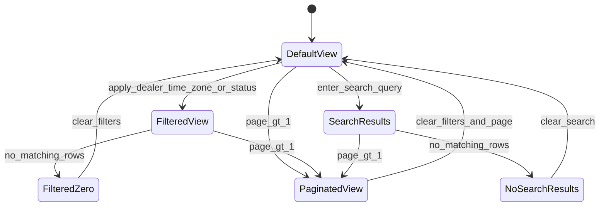

# Campaign list view — states and interactions

## State diagram

## Component mapping

| State | Component | Trigger |
|-------|-----------|---------|
| Default | `CampaignTable` + `PaginationBar` | `resolveEmptyStateVariant` → null |
| Filtered | Same | `hasActiveFilters` && results > 0 |
| Search results | Same | `filters.q` && results > 0 |
| Filtered zero | `EmptyState` variant `filteredZero` | filters active, total 0 |
| No search results | `EmptyState` variant `noSearchResults` | `q` set, total 0 |
| No data | `EmptyState` variant `noData` | mock/source empty |
| Loading | `app/campaigns/loading.tsx` | Suspense / navigation |
| Error | `app/campaigns/error.tsx` | route error boundary |

## URL parameters

`?q=&dealer=&timeZone=&status=&page=`

Parsed by `nuqs` in `CampaignListView` and `CampaignFilters`.

## Interaction states

Documented on `/campaigns/redlines` and implemented via Tailwind classes on table rows, buttons, inputs, badges, and pagination.
