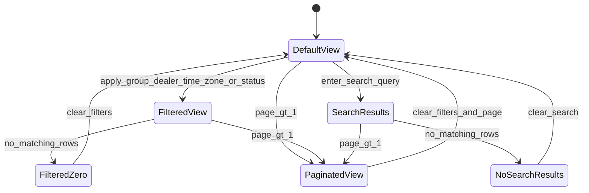

# Campaign list view — states and interactions

## State diagram

```mermaid
stateDiagram-v2
  [*] --> DefaultView
  DefaultView --> FilteredView: apply_group_dealer_time_zone_or_status
  DefaultView --> SearchResults: enter_search_query
  FilteredView --> FilteredZero: no_matching_rows
  SearchResults --> NoSearchResults: no_matching_rows
  DefaultView --> PaginatedView: page_gt_1
  FilteredView --> PaginatedView: page_gt_1
  SearchResults --> PaginatedView: page_gt_1
  FilteredZero --> DefaultView: clear_filters
  NoSearchResults --> DefaultView: clear_search
  PaginatedView --> DefaultView: clear_filters_and_page
```

## Component mapping

| State | Component | Trigger |
|-------|-----------|---------|
| Scope bar | `DealershipScopeBar` | Always under title; Group cascades into Dealer |
| Default | `CampaignTable` + `PaginationBar` | `resolveEmptyStateVariant` → null |
| Filtered | Same | `hasActiveFilters` && results > 0 |
| Search results | Same | `filters.q` && results > 0 |
| Filtered zero | `EmptyState` variant `filteredZero` | filters active, total 0 |
| No search results | `EmptyState` variant `noSearchResults` | `q` set, total 0 |
| No data | `EmptyState` variant `noData` | mock/source empty |
| Loading | `app/campaigns/loading.tsx` | Suspense / navigation |
| Error | `app/campaigns/error.tsx` | route error boundary |

## URL parameters

`?q=&group=&dealer=&timeZone=&status=&page=`

Parsed by `nuqs` in `CampaignListView`, `DealershipScopeBar`, and `CampaignFilters`.

- `group` / `dealer` live in the primary dealership scope bar under the title (cascading Group → Dealer, left-aligned).
- Time zone, status, and search remain in the secondary filter row.

## Interaction states

Documented on `/campaigns/redlines` and implemented via Tailwind classes on table rows, buttons, inputs, badges, and pagination.
