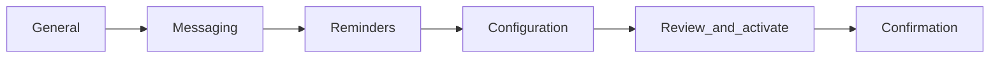

# Campaign setup flow

Mapped to **Campaign Manager: Standard Operating Procedure for Campaign Setup** (PDF).

## In-app wizard (Phase 2 — Campaign Configuration)

Planet X / Super Admin user provisioning (SOP Phase 1) is documented in the General step “Before you begin” callout only — not implemented as app screens.

| Step | Route `?step=` | SOP section | Key fields |
|------|----------------|-------------|------------|
| General | `general` | General Identification | Name (SM template), 2×3 image |
| Messaging | `messaging` | Messaging & Variables | Primary promo, Dealer URL, Additional URL |
| Reminders | `reminders` | Reminder Sequences | Enable, DID, Reminder 1–3 |
| Configuration | `configuration` | Standard Configuration | Type, Services, Subfleets, Frequency, Schedule |
| Review | `review` | QA & Activation | Test send, Activate |

## Components

| Component | Path |
|-----------|------|
| Wizard orchestrator | `CampaignSetupWizard.tsx` |
| Shell | `StepShellLayout.tsx`, `StepperHeader.tsx`, `MessagePreviewPanel.tsx` |
| Steps | `setup/steps/*.tsx` |
| Success | `ConfirmationView.tsx` |
| Message preview | `MessagePreviewPanel.tsx` — sticky phone mockup; `preview-message.ts` resolves variables with sample data |

## Validation

`src/lib/campaign-setup-validation.ts` — per-step rules aligned with SOP required fields.

## State

- Form draft: React `useState` (session-local)
- Current step: URL `?step=` via `nuqs` (bookmarkable)

## Mock behaviors

- Image upload: client preview only
- Send test / Activate: simulated delay, then confirmation screen
