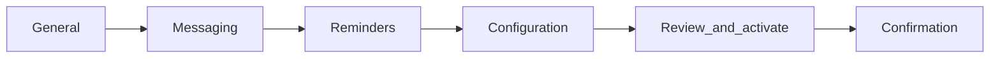

# Campaign setup flow

Mapped to **Campaign Manager: Standard Operating Procedure for Campaign Setup** (PDF).

## In-app wizard (Phase 2 — Campaign Configuration)

Planet X / Super Admin user provisioning (SOP Phase 1) is documented in the General step “Before you begin” callout only — not implemented as app screens.

```mermaid
flowchart LR
  general[General] --> messaging[Messaging]
  messaging --> reminders[Reminders]
  reminders --> configuration[Configuration]
  configuration --> review[Review_and_activate]
  review --> done[Confirmation]
```

| Step | Route `?step=` | SOP section | Key fields |
|------|----------------|-------------|------------|
| General | `general` | General Identification | Group, multi-select Dealerships (per-dealer timezone), campaign name |
| Messaging | `messaging` | Messaging & Variables | Delivery channels, templates, primary promo, dealer URL, optional image |
| Reminders | `reminders` | Reminder Sequences | Enable 1–3 reminders, text + image or reuse primary image |
| Configuration | `configuration` | Standard Configuration | Service trigger mode (interval, OEM, or audience query), schedule days, optional send time + SOP timezone table |
| Review | `review` | QA & Activation | Test send, suppression list, TCPA confirmation, Activate |

## Components

| Component | Path |
|-----------|------|
| Wizard orchestrator | `CampaignSetupWizard.tsx` |
| Shell | `StepShellLayout.tsx`, `StepperHeader.tsx`, `MessagePreviewPanel.tsx` |
| Steps | `setup/steps/*.tsx` |
| Success | `ConfirmationView.tsx` |
| Message preview | `MessagePreviewPanel.tsx` — SMS device + email inbox mockups; channel tabs when both enabled; primary promo on General/Messaging/Configuration/Review, reminders only on Reminders step. Sender uses the first selected dealership. |
| Send time | `setup/SendTimeField.tsx` — hour / minute / AM-PM design-system selects (no native `input[type=time]`); conversions in `src/lib/send-time.ts` |

## Validation

`src/lib/campaign-setup-validation.ts` — per-step rules aligned with SOP required fields.

- General requires group + ≥1 dealership; missing dealer TZ needs a row-level fallback.
- Configuration accepts empty optional `sendTimeLocal`; when set it must be `HH:mm` (24-hour). The picker only emits valid values and offers 5-minute steps, keeping an off-step minute selectable if a draft already holds one.

## State

- Form draft: React `useState` (session-local)
- Current step: URL `?step=` via `nuqs` (bookmarkable)
- Draft fields include `groupId`, `subfleets` (dealership ids), `timezoneOverrides`, `sendTimeLocal`, derived `timeZone`

## Campaign statuses (list / filters)

`draft` · `active` · `paused` · `completed` · `archived`  
Future activation date is stored on `scheduledActivateAt` while status remains `draft` (Scheduled is not a status).

## Mock behaviors

- Image upload: client preview only
- Send test / Activate: simulated delay, then confirmation screen
