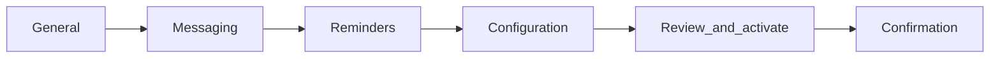

# Campaign setup flow

Mapped to **Campaign Manager: Standard Operating Procedure for Campaign Setup** (PDF).

## In-app wizard (Phase 2 — Campaign Configuration)

Planet X / Super Admin user provisioning (SOP Phase 1) is documented in the General step “Before you begin” callout only — not implemented as app screens.

```mermaid
flowchart LR
  general[General] --> messaging[Messaging]
  messaging --> reminders[Reminders]
  reminders --> configuration[Configuration]
  configuration --> review[Review_and_activate]
  review --> done[Confirmation]
```

| Step | Route `?step=` | SOP section | Key fields |
|------|----------------|-------------|------------|
| General | `general` | General Identification | Group, multi-select Dealerships (per-dealer timezone), campaign name |
| Messaging | `messaging` | Messaging & Variables | Delivery channels, templates, primary promo, dealer URL, optional image |
| Reminders | `reminders` | Reminder Sequences | Enable 1–3 reminders, text + image or reuse primary image |
| Configuration | `configuration` | Standard Configuration | Service trigger mode (interval, OEM, or audience query), campaign duration (required start date, optional end date), schedule days, required send time + timezone table that recomputes from the selected send time |
| Review | `review` | QA & Activation | Test send, suppression list, Activate or Schedule (from start date), Save Draft |

## Components

| Component | Path |
|-----------|------|
| Wizard orchestrator | `CampaignSetupWizard.tsx` |
| Shell | `StepShellLayout.tsx`, `StepperHeader.tsx`, `MessagePreviewPanel.tsx` |
| Steps | `setup/steps/*.tsx` |
| Success | `ConfirmationView.tsx` |
| Message preview | `MessagePreviewPanel.tsx` — SMS device + email inbox mockups; channel tabs when both enabled; primary promo on General/Messaging/Configuration/Review, reminders only on Reminders step. Sender uses the first selected dealership. |
| Send time | `setup/SendTimeField.tsx` — hour / AM-PM design-system selects (no native `input[type=time]`; minutes fixed at `:00`); conversions in `src/lib/send-time.ts` |
| Campaign duration | Native `input[type=date]` pair on the Configuration step; window resolution and rules in `src/lib/campaign-window.ts` |
| Schedule timezone table | Rows come from `src/lib/schedule-time-zones.ts`. Once a send time is pinned, every dealership sends at that same local clock time and each row converts back to the primary dealership's zone, flagging `(prev day)` / `(next day)` rolls. |

## Validation

`src/lib/campaign-setup-validation.ts` — per-step rules aligned with SOP required fields.

- General requires group + ≥1 dealership; missing dealer TZ needs a row-level fallback.
- Configuration requires `sendTimeLocal` as `HH:mm` (24-hour). The picker offers whole hours only (minutes always `:00`).
- Configuration requires `campaignStartDate`. `campaignEndDate` is optional; when set, the end date must land on or after the start date (`validateCampaignWindow`).

## State

- Form draft: React `useState` (session-local); on Save Draft the full `CampaignSetupDraft` is stored on the campaign as `setupDraft`
- Current step: URL `?step=` via `nuqs` (bookmarkable)
- Draft fields include `groupId`, `subfleets` (dealership ids), `timezoneOverrides`, `sendTimeLocal`, derived `timeZone`, and the run window (`campaignStartDate`, `campaignEndDate`)

## Draft resume / edit

- Detail (`/campaigns/[id]`) for `draft`: **Continue setup** when incomplete; **Edit** + **Review & activate** when all progress steps validate
- Edit route: `/campaigns/[id]/edit?step=…` — hydrates wizard from `setupDraft` (or recovery from thin legacy drafts)
- Edit Save Draft updates the same campaign id and returns to detail; Discard draft leaves setup without saving the current in-memory changes
- Edit-mode stepper allows jumping to completed steps + current; future steps stay locked
- Spec: `docs/superpowers/specs/2026-08-14-draft-resume-edit-design.md`

## Campaign run window

Configuration is the only place that collects campaign timing. Review has a single launch button whose label depends on the start date.

- `campaignStartDate` is required; the campaign starts at the beginning of that local day.
- End date is optional; blank means no fixed end. When set, `createCampaignFromDraft` resolves fields into `startsAt` / `endsAt` instants via `resolveCampaignWindow(draft, now)`; the end date always runs through 23:59:59.999 local.
- The Review launch button is **Activate** when the start date is today and **Schedule** when it is later. Both move the campaign to `active`. When the start date is in the future, sends wait for the start-date gate; no `scheduled` status is introduced.

## Campaign statuses (list / filters)

`draft` · `active` · `paused` · `completed` · `archived`  
Future campaign starts use `startsAt` while status is `active` (Scheduled is not a status).

Default list (`status=All`) hides `archived` campaigns. Filter Status → Archived to see them. From detail: Pause / Resume when live; Archive (confirm, irreversible) from active, paused, or completed.

## Live campaign copy edit

- Route: `/campaigns/[id]/copy`, available only for `active` and `paused`.
- Editable fields: initial message body and each enabled reminder body.
- Locked fields: campaign name, audience, dealerships, trigger, schedule, CTA/link configuration, reminder structure, and personalization variable sequence.
- Save preserves the current campaign status, updates `lastUpdatedAt` / `copyUpdatedAt`, and records a live-message-copy `updated` changelog event.
- Updated copy applies only to new or not-yet-sent recipients. It does not resend completed steps or bypass consent, STOP, quiet-hours, or suppression controls.

## Mock behaviors

- Image upload: client preview only
- Send test / Activate: simulated delay, then confirmation screen
