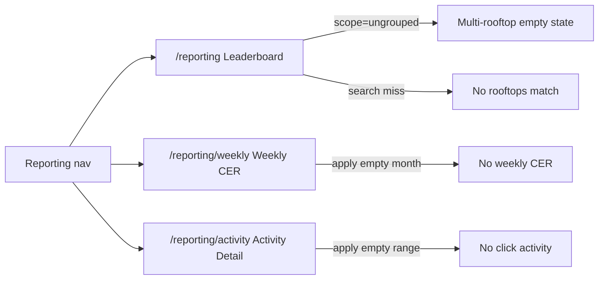

# Reporting — states and interactions

Entry: set Version to **Post MVP V1.1** (Existing reporting dropdown appears) → Smart Marketing sidebar **Reporting** → `/reporting`. Other versions hide both the dropdown and the Reporting nav.

## Tabs

| Tab | Route | Ticket |
|---|---|---|
| Leaderboard | `/reporting` | SM2-207 |
| Weekly CER | `/reporting/weekly` | SM2-208 |
| Activity Detail | `/reporting/activity` | SM2-209 |

## Leaderboard

- Rank unit is **rooftop**. Dealer group is a secondary label, never the ranked entity.
- Include only dealer groups with 2+ SM-enabled rooftops.
- Sort qualified rows by CER% descending. `sent < 50` → Low sample, rank `—`, listed after qualified rows.
- Filters: search, MTD / LM / YTD, Export CSV.
- `?scope=ungrouped` (or Preview ungrouped rooftop) hides the table.

## Weekly CER

- Title: **Smart Service Lead Weekly CER (By Message)**
- Draft filters: Year, Month, searchable Dealer. Apply commits the set.
- Each week is a stacked **Weekly Performance** card with Initial + Reminder 1–3 and a green CER% row.

## Activity Detail

- Title: **Smart Service Lead Activity Detail**
- Draft filters: Date From, Date To, Dealer, Rooftop. Apply commits the set.
- Summary cards: Messages Sent, Total Clicks, Uplift %, CER %.
- Table columns: Customer, VIN, Phone, Email, Click Date, Message, **Mileage**. Missing mileage renders `—`.
