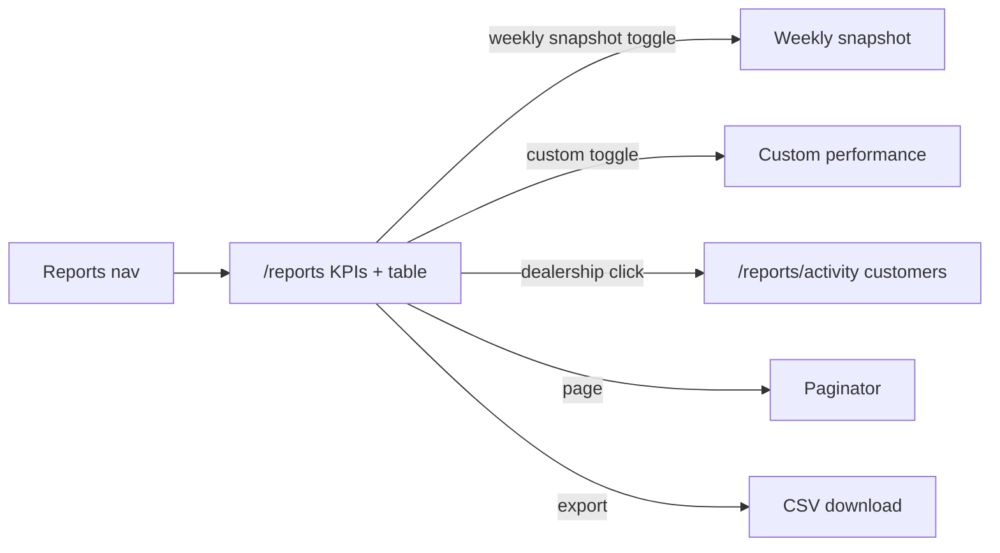

# Reports — states and interactions

Entry: Smart Marketing sidebar **Reports** → `/reports`. Reports ship in every product version (**MVP V1.0** and **Post MVP V1.1**), so there is no reporting-mode dropdown and no version gate on the route. `/dashboards*` permanently redirects here. List and activity pages use the title bar without breadcrumbs, matching Campaigns.

- KPIs stay in one row in Custom mode: Messages sent, Total clicks, Reminder Uplift, CER %. Weekly Snapshot hides the strip; each week card already carries sent / clicks / CER %.
- Custom mode adds a **Sort By** dropdown on the right of the filter row, with the Custom / Weekly Snapshot toggle and Export CSV. The trigger always reads Sort By; the menu lists Messages sent, Total clicks, Reminder Uplift, and CER %. Until a metric is chosen the table keeps the CER ranking. Choosing a metric re-ranks highest-first. Reminder Uplift is each dealership's CER change against the equally long preceding date window. Changing the metric resets pagination to page 1, and the selection is stored in the `metric` query parameter.
- Mode toggle is uppercase **Custom** / **Weekly Snapshot**, black idle and green when selected. Query values stay `monthly` / `weekly`.
- Custom mode ranks dealerships in a stacked list (rank badge, dealership, group, campaign, metric grid, and CER %). Click a dealership to open activity. Campaign names the live campaign covering that rooftop (active over paused over completed); extra campaigns collapse to a +N count. Drafts and archives stay off the column. Rooftops with no sent campaign show —.
- Weekly Snapshot stacks one card per week, newest first, with vertical spacing between cards. Cards start at the date range; there is no extra stack header above the cards.
- Each week card leads with its date range and carries its own column header, so it reads standalone. It sums every dealer in scope across Initial / Reminder 1–3 plus a Total column, over Messages Sent / Clicks / CER % rows. A week covering fewer rooftops than the scope notes "N rooftops reporting" beside its date range.
- Campaign-style Group and Dealer filters scope the card; the weekly paginator pages week sections, not dealer cards.
- The reports list title bar has no subtitle. The date range filter sits on the same row as the Reports heading, top right, above Export CSV. It defaults to the current month to date and reads `This Month · Sep 1 – 8, 2026`. Its preset sidebar offers This Month, Last Month, Last 3 Days, Last 7 Days, Last Week, Last 30 Days, Last 90 Days, Last 6 Months, and Year To Date; two clicks on the two-month calendar set any custom range, which the trigger labels `Custom`. Future days are not selectable, and picking a preset or completing a range closes the popover. The range lives in the `from`/`to` query params, and an unparseable or reversed pair falls back to the default.
- The range drives Custom mode only: rows and KPIs sum the days in range, and Uplift compares against the equally long window immediately before it. Dealerships with no messages in range drop out of the ranking. Weekly Snapshot reports whole weeks, so the date filter is hidden there and the `from`/`to` selection is kept for the return to Custom.
- Activity reads the shared customer click rows in `src/data/reporting.mock.ts`. Every dealership has at least 10 customers with click stats. Opening a dealership fixes that dealership as the activity scope.
- The activity filter is **Campaigns**, not dealership. It defaults to **Show All** and lists only active, paused, or completed campaigns associated with the selected dealership; drafts and archives are excluded. Selecting one campaign filters the customer rows and CSV export, while the dealership remains fixed in the page title and URL.
- Activity carries its own Campaign column, one campaign per customer. A dealership's campaigns are dealt round-robin down its rows, so a rooftop running three campaigns shows all three rather than repeating the top one. Attribution runs over the full activity set before filtering, so a customer keeps the same campaign whether the list is scoped to one dealership or showing every rooftop.
- The monthly paginator sits in the table card footer, the slot `DesignSystemTableShellNoTabs` requires; the weekly one sits under the weekly card, which is not wrapped in that shell. Group, dealer, and mode changes reset to page 1.
