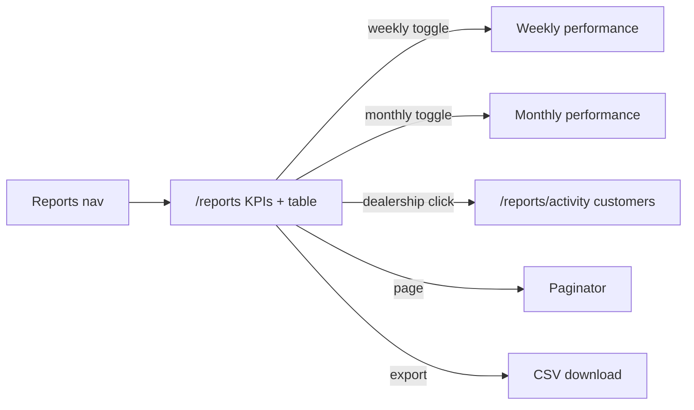

# Reports — states and interactions

Entry: Smart Marketing sidebar **Reports** → `/reports`. Reports ship in every product version (**MVP V1.0** and **Post MVP V1.1**), so there is no reporting-mode dropdown and no version gate on the route. `/dashboards*` permanently redirects here.

- KPIs stay in one row: Messages sent, Total clicks, Reminder Uplift, CER %.
- Mode toggle is uppercase black, green when selected.
- Monthly mode ranks dealerships in a stacked list (rank badge, dealership, group, campaign, metric grid, and CER %). Click a dealership to open activity. Campaign names the live campaign covering that rooftop (active over paused over completed); extra campaigns collapse to a +N count. Drafts and archives stay off the column. Rooftops with no sent campaign show —.
- Weekly mode is one card whose sections are weeks, newest first. The card names its scope once — a single dealership links to activity, a group or the portfolio reads "cumulative (N rooftops)" — so no section repeats the title or the dealer name.
- Each week section sums every dealer in scope across Initial / Reminder 1–3 plus a Total column, over Messages Sent / Clicks / CER % rows. A week covering fewer rooftops than the scope notes "N rooftops reporting".
- Campaign-style Group and Dealer filters scope the card; the weekly paginator pages week sections, not dealer cards.
- A date range filter sits at the top right of the filter row, defaulting to the current month to date and reading `This month · Sep 1 – 8, 2026`. Its preset sidebar offers This month, Last month, Last 3 days, Last 7 days, Last week, Last 30 days, Last 90 days, Last 6 months, and Year to date; two clicks on the two-month calendar set any custom range, which the trigger labels `Custom`. Future days are not selectable, and picking a preset or completing a range closes the popover. The range lives in the `from`/`to` query params, and an unparseable or reversed pair falls back to the default.
- The range drives monthly mode only: rows and KPIs sum the days in range, and Uplift compares against the equally long window immediately before it. Dealerships with no messages in range drop out of the ranking. Weekly mode reports whole weeks, so the filter is disabled there and the selection is kept for the return to monthly.
- Activity reads the shared customer click rows in `src/data/reporting.mock.ts`. Every dealership has at least 10 customers with click stats. Open a dealership to filter activity.
- Activity carries its own Campaign column, one campaign per customer. A dealership's campaigns are dealt round-robin down its rows, so a rooftop running three campaigns shows all three rather than repeating the top one. Attribution runs over the full activity set before filtering, so a customer keeps the same campaign whether the list is scoped to one dealership or showing every rooftop.
- The monthly paginator sits in the table card footer, the slot `DesignSystemTableShellNoTabs` requires; the weekly one sits under the weekly card, which is not wrapped in that shell. Group, dealer, and mode changes reset to page 1.
