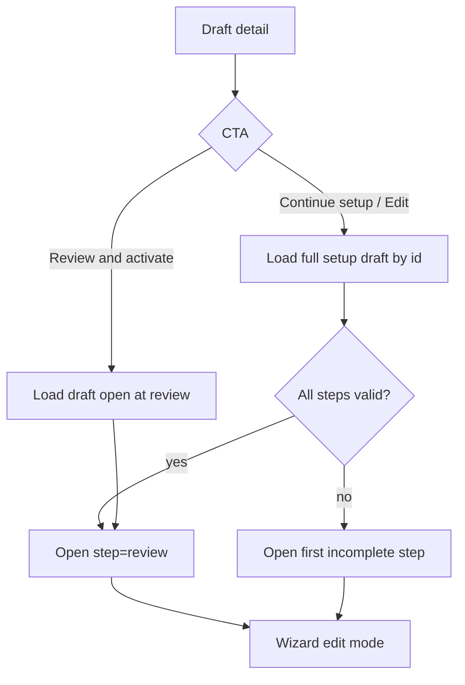

# Draft campaign resume / edit

## Goal

Creators can reopen a **Draft** campaign from detail, change setup fields in the existing New Campaign wizard, Save Draft without losing the campaign identity, and either return to Draft detail or continue toward Activate / Schedule from Review.

## Non-goals

- Editing **Active** / **Paused** / **Completed** / **Archived** campaigns
- Change Log tab content
- Performance metrics definitions
- Implementing real PATCH/update APIs (design notes only; mock store updates in POC)

## Locked decisions

| Topic | Decision |
|-------|----------|
| Wizard steps | Match current product: General → Messaging → Reminders → Configuration → Review (`?step=`) |
| Audience / Schedule | Remain inside Configuration; step-split is follow-on |
| Detail primary CTA | Incomplete → **Continue setup**; complete → **Edit** |
| Secondary CTA (complete only) | **Review & activate** → wizard at Review |
| Resume landing | Complete → Review; else → first incomplete step |
| Stepper navigation | Jump to completed steps + current; lock future. When all complete, all steps jumpable |
| Editable fields | Everything editable while status is `draft` |
| Save Draft | Update in place (same `campaign.id`); bump `updatedAt`; redirect to Draft detail |
| Cancel / leave | Same leave-guard pattern as New Campaign |
| Abandon | Discard **unsaved edits only**; never delete the draft campaign |
| Persistence | Full `CampaignSetupDraft` (or equivalent) must be stored with the campaign for true resume |

---

## Entry points

### Draft detail header (`/campaigns/[id]`, status = `draft`)

| Setup completeness | Primary | Secondary |
|--------------------|---------|-----------|
| Incomplete | **Continue setup** | — |
| Complete (all steps valid) | **Edit** | **Review & activate** |

- Labels must be visible button text (not icon-only).
- Focus order: title/status → primary CTA → secondary CTA → tabs.
- Keyboard: Tab reaches CTAs; Enter/Space activates.

### Completeness definition

A draft is **complete** when every setup step passes the existing per-step validators (`validateSetupStep` / equivalent for all of `SETUP_STEPS`). Otherwise **incomplete**.

UI may show a short subtitle under the title when incomplete, e.g. “Setup incomplete — continue to finish before activating.” Exact copy can match product voice; intent is progress, not blame.

### Out of scope from detail

- No Activate / Schedule buttons on detail itself (activation stays on Review).
- No Archive on draft (unchanged from archive/pause spec).

---

## Routes & modes

| Route | Mode | Behavior |
|-------|------|----------|
| `/campaigns/new?step=…` | **Create** | Current behavior: empty draft, Save Draft **creates** a new campaign |
| `/campaigns/[id]/edit?step=…` | **Edit** | Hydrate from saved campaign setup payload; Save Draft **updates** that id |

Templates already use `/templates/[id]/edit`; campaigns mirror that pattern.

### Guards on `/campaigns/[id]/edit`

1. **Not found** — campaign id missing → empty state + link back to `/campaigns`
2. **Not a draft** — status ≠ `draft` → deny edit; message that only drafts can be edited here + link to detail (or list). Do not silently open create flow.
3. **Corrupt / incomplete payload** — required setup blob missing or unparseable → show recovery state: explain that setup data is incomplete; offer **Start over from saved basics** (hydrate what exists + defaults) and **Back to detail**. Do not invent fake messaging/audience data without making defaults obvious.

No real RBAC in POC. If later permissions exist: permission-denied page with no field leakage.

---

## Resume behavior



### Landing step rules

1. Explicit deep-link (`?step=` on edit URL) wins if that step is allowed for the draft’s progress (see stepper rules). Invalid/locked step → clamp to first incomplete (or Review if complete).
2. **Continue setup** / **Edit** with no step param:
   - Complete → `review`
   - Incomplete → first step that fails validation (scan General → … → Review)
3. **Review & activate** → always `review` (only shown when complete)

### Stepper (edit mode)

- Visual state: completed / current / locked (future), same shell as create.
- **Clickable** for completed + current (edit mode only; create may stay linear display-only unless product later unifies).
- Completion flags: on hydrate, mark a step complete only if it currently passes validation. Edits re-run that step’s validator on blur/Continue; if it fails, that step (and any later steps) become incomplete for stepper locking. Activate/Schedule always re-validates all steps.
- **Continue** / **Back** behave as today.
- Footer still includes **Cancel** (leave-guard).

---

## Editable vs locked

While `status === "draft"`:

- **All wizard fields editable** (Group, dealerships, messaging, reminders, configuration, review extras).
- Product-version locks remain (e.g. MVP V1.0 SMS-only, Oil Change template) — same as create.
- Campaign **id** is immutable (not a form field).
- Status stays `draft` until Activate / Schedule from Review succeeds.

No field locks unique to edit mode in this pass.

---

## Save Draft / Cancel / Abandon

### Save Draft (edit mode)

| Aspect | Behavior |
|--------|----------|
| When available | Review step button (same as create); leave-guard **Save Draft** |
| Validation | Explicit Save from Review: require campaign name (same as create). Leave-guard Save: may allow untitled / soft name (same as create leave-guard). |
| Persistence | **Update** existing campaign: same `id`, `status: draft`, merge full setup payload, set `updatedAt` |
| Navigation | Redirect to **`/campaigns/[id]`** (Draft detail), not list |
| Flash | Detail or list-compatible success: e.g. “Draft saved” |

Create mode unchanged: Save Draft creates new id and may still land on list with flash (existing behavior) unless a later pass unifies both to detail.

### Leave-guard (edit mode)

Reuse **Campaign In Progress** modal:

| Action | Result |
|--------|--------|
| **Keep Editing** | Dismiss; stay on wizard |
| **Save Draft** | Persist update-in-place; go to Draft detail |
| **Abandon** | Discard **in-memory unsaved changes**; navigate to requested destination (usually Draft detail or list). **Do not delete** the campaign. Last saved draft remains. |

Triggers: Cancel, breadcrumb Campaigns, sidebar nav, `beforeunload` while dirty — same as create.

### Dirty tracking

- Edit mode: dirty when current form ≠ hydrated snapshot (or ≠ last successful save).
- Leave-guard only when dirty (recommended). If not dirty, Cancel navigates away with no modal.

### Activate / Schedule from Review (edit mode)

- Same UI as create Review.
- On success: campaign leaves draft (active or scheduled-activate-at + draft, per existing status rules); redirect/confirmation matches create flow.
- Does not create a second campaign.

---

## Empty / error states

| State | Surface | UX |
|-------|---------|-----|
| Campaign not found | Detail + edit route | “Campaign not found” + Back to campaigns |
| Not a draft | Edit route | Explain only drafts are editable; link to `/campaigns/[id]` |
| Corrupt setup payload | Edit route | Recovery copy + Start over from basics / Back to detail |
| Wizard validation errors | Steps | Existing inline `FormField` errors |
| List/detail load failure | Existing error boundary | Unchanged |

Permission-denied: stub copy only if/when authz exists; out of POC wiring.

---

## Accessibility (desktop)

- Header CTAs: clear names — “Continue setup”, “Edit”, “Review & activate” (not “Edit draft campaign setup wizard”).
- Focus moves to main step heading or first invalid field when landing on a step with errors.
- Stepper buttons: `aria-current="step"` on current; disabled/locked steps `aria-disabled` and not in tab order (or tabbable but announced as unavailable).
- Leave-guard: focus trap, Escape = Keep Editing (or close without discard), primary/secondary actions labeled.
- Do not rely on color alone for incomplete vs complete (text + stepper state).

---

## Data & eng notes (no API implementation in this design pass)

### Problem today

- `createCampaignFromDraft` always mints a new id.
- Persisted `Campaign` keeps a thin subset; messaging / reminders / audience / schedule details are not round-tripped.
- No `campaign → setup draft` hydration.

### Required model (POC mock + future API)

Store with each draft campaign:

1. Public list/detail fields (unchanged)
2. **`setupDraft: CampaignSetupDraft`** (full wizard state), or equivalent normalized columns that can rebuild it
3. Optional **`lastSetupStep`**: last successfully viewed/completed step id (nice-to-have; landing prefers validation scan over this)
4. **`updatedAt`** on every save

### Mock store operations (POC)

- `getCampaignSetupDraft(id)` → hydrate wizard
- `updateCampaignFromDraft(id, draft, { status })` → in-place update
- Keep `createCampaignFromDraft` for create mode only

### Future HTTP (design only)

- `GET /campaigns/:id` includes setup payload when draft (or `GET /campaigns/:id/setup`)
- `PATCH /campaigns/:id` with setup fields + optimistic concurrency (`updatedAt` / `etag`) — concurrency UI out of scope for POC
- Do not use `POST /campaigns` for edit saves

### Migration of existing thin drafts

Campaigns saved before full payload:

- Treat as **corrupt/incomplete payload** recovery path, or
- One-time hydrate: map known fields → draft defaults for the rest; mark steps incomplete so Continue setup lands on first gap

Prefer explicit recovery over silent wrong messaging.

---

## UI summary (Draft detail)

```
[Campaign name]                    [Continue setup]     // incomplete
Draft · Updated <relative>

[Campaign name]           [Edit] [Review & activate]  // complete
Draft · Ready to activate
```

Detail tabs (Details / Change Log) unchanged in content scope; Details may later show a setup summary — optional, not required for this pass.

---

## Testing expectations (for implementation plan)

- Draft incomplete: header shows Continue setup → edit route → first incomplete step
- Draft complete: Edit → Review; Review & activate → Review
- Save Draft updates same id; detail shows new `updatedAt`; no duplicate row
- Abandon after edits restores last saved values; campaign still listed as draft
- Edit URL for active campaign blocked
- Missing id → not found
- Keyboard: CTAs and stepper reachable; leave-guard operable

## Open follow-ons

- Split Configuration into Audience + Schedule steps
- Unify create Save Draft destination to detail
- Clickable stepper in create mode
- Concurrent-edit / stale PATCH handling
- Edit Active / Paused campaigns
